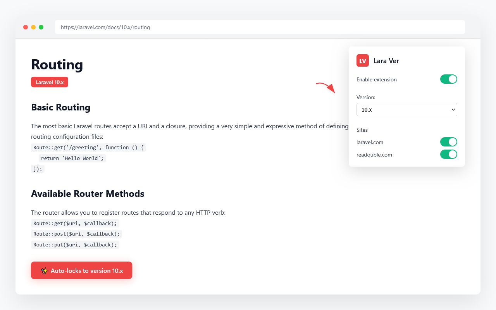

# 🔒 Lara Ver - Laravel Documentation Version Manager

<div align="center">
  

  <h3>Never lose your place in Laravel documentation again!</h3>

  [](https://github.com/ryo-morimoto/lara-ver/releases)
  [](LICENSE)
  [](https://chrome.google.com/webstore)
  [](https://github.com/antfu/eslint-config)

  [English](#english) | [日本語](#japanese)
</div>

---

## <a name="english"></a>🌟 Overview

**Lara Ver** is a browser extension that automatically locks Laravel documentation to your preferred version. Perfect for developers who frequently reference Laravel docs while working on specific version projects.

### ✨ Features

- 🔒 **Automatic Version Locking** - Set once, browse freely
- 🌐 **Multi-site Support** - Works on both laravel.com and readouble.com
- ⚡ **Lightning Fast** - Instant redirects with no page flashing
- 🔐 **Privacy Focused** - All settings stored locally, no data collection
- 🎯 **Lightweight** - Minimal performance impact
- 🎨 **Simple UI** - Clean, intuitive interface

### 📸 Screenshots

<div align="center">
  
  <br>
  <em>Simple and intuitive popup interface</em>
</div>

### 🚀 Installation

#### Chrome Web Store (Recommended)
1. Visit the [Chrome Web Store](https://chrome.google.com/webstore) (Coming Soon)
2. Click "Add to Chrome"
3. Click the extension icon and select your preferred Laravel version

#### Manual Installation (Developer Mode)
1. Clone this repository
   ```bash
   git clone https://github.com/ryo-morimoto/lara-ver.git
   cd lara-ver
   ```
2. Install dependencies and build
   ```bash
   pnpm install
   pnpm build
   ```
3. Open Chrome and navigate to `chrome://extensions/`
4. Enable "Developer mode"
5. Click "Load unpacked" and select the `.output/chrome-mv3` directory

### 📖 Usage

1. **Click the extension icon** in your browser toolbar
2. **Toggle "Enable extension"** to activate
3. **Select your preferred version** from the dropdown
4. **Choose which sites** to apply version locking
5. **Browse Laravel docs** without version switching interruptions!

### 🛠️ Development

```bash
# Install dependencies
pnpm install

# Start development mode
pnpm dev

# Build for production
pnpm build

# Create distributable ZIP
pnpm zip

# Run tests
pnpm test

# Run linting
pnpm lint
```

### 🏗️ Architecture

Built with modern web technologies:
- [WXT](https://wxt.dev/) - Next-gen web extension framework
- [React 19](https://react.dev/) - UI components
- [TypeScript](https://www.typescriptlang.org/) - Type safety
- [Zod](https://zod.dev/) - Runtime validation
- [Vitest](https://vitest.dev/) - Unit testing
- [Playwright](https://playwright.dev/) - E2E testing

### 🤝 Contributing

Contributions are welcome! Please read our [Development Guidelines](docs/development-guidelines.md) before submitting PRs.

1. Fork the repository
2. Create your feature branch (`git checkout -b amazing-feature`)
3. Commit your changes (`git commit -m 'Add amazing feature'`)
4. Push to the branch (`git push origin amazing-feature`)
5. Open a Pull Request

### 📝 License

This project is licensed under the MIT License - see the [LICENSE](LICENSE) file for details.

---

## <a name="japanese"></a>🌟 概要

**Lara Ver**は、Laravelドキュメントを希望のバージョンに自動的に固定するブラウザ拡張機能です。特定バージョンのプロジェクトで作業する開発者に最適です。

### ✨ 機能

- 🔒 **自動バージョン固定** - 一度設定すれば自由に閲覧
- 🌐 **マルチサイト対応** - laravel.comとreadouble.comの両方に対応
- ⚡ **高速動作** - 瞬時にリダイレクト、画面のちらつきなし
- 🔐 **プライバシー重視** - すべての設定はローカル保存、データ収集なし
- 🎯 **軽量設計** - パフォーマンスへの影響最小限
- 🎨 **シンプルなUI** - 直感的でクリーンなインターフェース

### 📸 スクリーンショット

<div align="center">
  
  <br>
  <em>シンプルで直感的なポップアップインターフェース</em>
</div>

### 🚀 インストール

#### Chrome ウェブストア（推奨）
1. [Chrome ウェブストア](https://chrome.google.com/webstore)にアクセス（準備中）
2. 「Chromeに追加」をクリック
3. 拡張機能アイコンをクリックして、希望のLaravelバージョンを選択

#### 手動インストール（開発者モード）
1. このリポジトリをクローン
   ```bash
   git clone https://github.com/ryo-morimoto/lara-ver.git
   cd lara-ver
   ```
2. 依存関係をインストールしてビルド
   ```bash
   pnpm install
   pnpm build
   ```
3. Chromeで `chrome://extensions/` を開く
4. 「デベロッパーモード」を有効化
5. 「パッケージ化されていない拡張機能を読み込む」をクリックし、`.output/chrome-mv3`ディレクトリを選択

### 📖 使い方

1. **ブラウザツールバーの拡張機能アイコン**をクリック
2. **「Enable extension」をトグル**して有効化
3. **ドロップダウンから希望のバージョン**を選択
4. **バージョン固定を適用するサイト**を選択
5. **Laravelドキュメント**をバージョン切り替えの煩わしさなく閲覧！

### 🛠️ 開発

```bash
# 依存関係のインストール
pnpm install

# 開発モードの開始
pnpm dev

# プロダクションビルド
pnpm build

# 配布用ZIPの作成
pnpm zip

# テストの実行
pnpm test

# リンティングの実行
pnpm lint
```

### 🏗️ アーキテクチャ

最新のWeb技術で構築：
- [WXT](https://wxt.dev/) - 次世代Web拡張機能フレームワーク
- [React 19](https://react.dev/) - UIコンポーネント
- [TypeScript](https://www.typescriptlang.org/) - 型安全性
- [Zod](https://zod.dev/) - ランタイムバリデーション
- [Vitest](https://vitest.dev/) - ユニットテスト
- [Playwright](https://playwright.dev/) - E2Eテスト

### 🤝 コントリビューション

コントリビューションを歓迎します！PRを提出する前に[開発ガイドライン](docs/development-guidelines.md)をお読みください。

1. リポジトリをフォーク
2. フィーチャーブランチを作成（`git checkout -b amazing-feature`）
3. 変更をコミット（`git commit -m 'Add amazing feature'`）
4. ブランチにプッシュ（`git push origin amazing-feature`）
5. プルリクエストを作成

### 📝 ライセンス

このプロジェクトはMITライセンスの下でライセンスされています。詳細は[LICENSE](LICENSE)ファイルをご覧ください。

---

<div align="center">
  <p>
    <strong>Made with ❤️ by <a href="https://github.com/ryo-morimoto">Ryo Morimoto</a></strong>
  </p>
  <p>
    <a href="https://github.com/ryo-morimoto/lara-ver/issues">Report Bug</a>
    ·
    <a href="https://github.com/ryo-morimoto/lara-ver/issues">Request Feature</a>
  </p>
</div>
